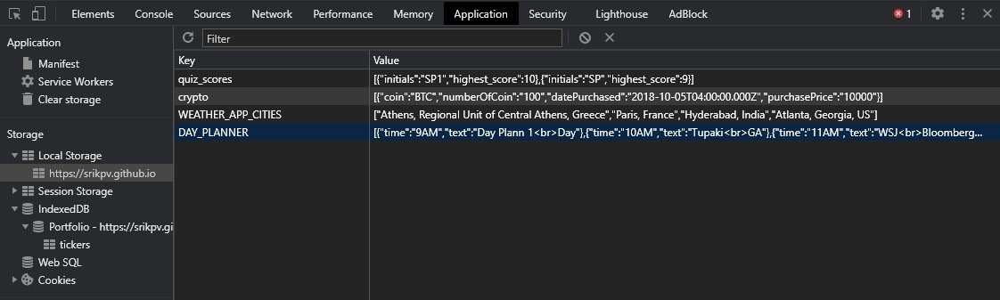

# Portfolio Tracker

Portfolio Tracker app helps users track their stocks and cryptos assets along with capital gains/loss information.

## Main Features

  - Real time tracking of stocks and crypto assets
  - Consolidated view in an easy to use interface
  - Real time capital gains/loss information
  - Stock Ticker autocompletion
  - Support for hundreds of actively traded stocks on US exchanges
  - Support for Cryptocurrencies i.e. Bitcoin, Ethereum, Litecoin, Bitcoin cash
  - Stock Ticker Autocompletion
  - Real time data provided by Tiingo and Coinranking
  - Capital Gains/Loss calculation based on purchase date
  - Personal data stored on users local machine

## Project Overview

### Description

Portfolio Tracker Application provides users ability to track their Stocks and Crypto portfolio and real time capital gains and losses

### Motivation
Today, there are different websites that provide stock and crypto information. The objective is to provide a single tool to capture the portfolio and its history

### Technologies Used

  - Used the Foundation CSS framework as the underpinning of a polished, mobile-first UI
  - Adhered to peer reviews for good quality coding standards (indentation, scoping, naming etc
  - Did NOT use alerts, confirms, or prompts as a technology solution
  - Designed to be interactive (i.e. accepts and responds to user input)
  - Application is deployed via GitHub Pages
  - Uses DOM client-side storage to store persistent data
  - Uses two different server-side APIs for stocks and crypto

### Technical Specifications

  -   IndexedDB – Table with Primary key and identity
  -   Local Storage
  -   Object Oriented JavaScript, Classes
  -   jquery for UI
  -   Foundation CSS Framework, mobile-first API
  -   Autocompletion using JSON
  -   async and await, promises
  -   Real time stock quotes provider – Tiingo
  -   Real Time Crypto Quotes provider – CoinRanking

  ###

  Application url -  [Portfolio Tracker](https://srikpv.github.io/GTBootCamp_Project1/index.html)

  Screenshot -

  
  
  

  

### Lessons Learned

  - Timely communications for executing, collaborating, and closing the different work streams of the team to achieve specific goals
  - Better communication regarding changes in project requirements and interfaces 

### Successes

Delivered iterative and incremental development towards an MVP1 version of the page that met the specific success criteria within the specified time
Came together as a combined team to quickly resolve discrepancies, complete testing, and to integrate the various work streams into a functional product

### Team Members

  - Pillarisetty Venkata, Srikanth
  - Ten, Melvyn
  - Wright, Jamal
  - McGinnis, Jerron
  - Crowder, Michael
  - Hermann, Anthony R
  - Arora, Rakesh